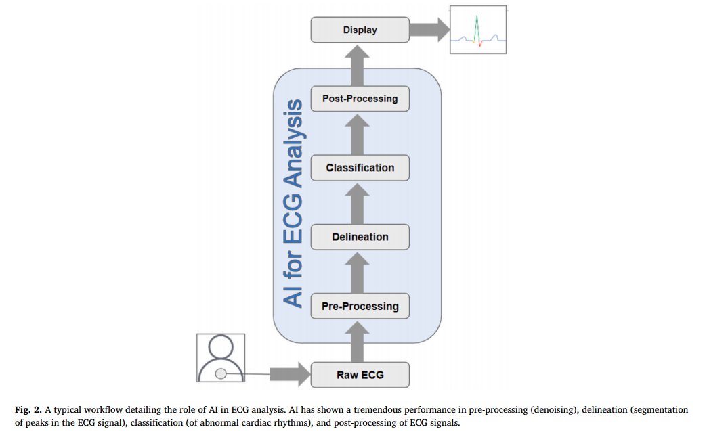
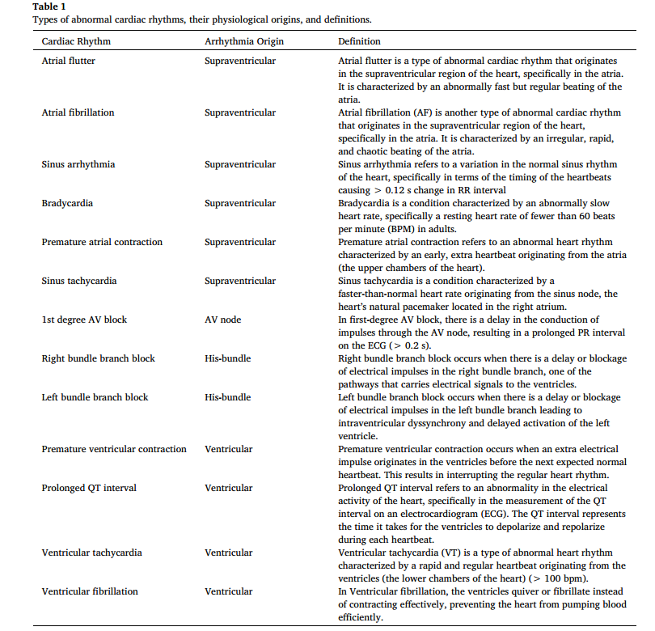
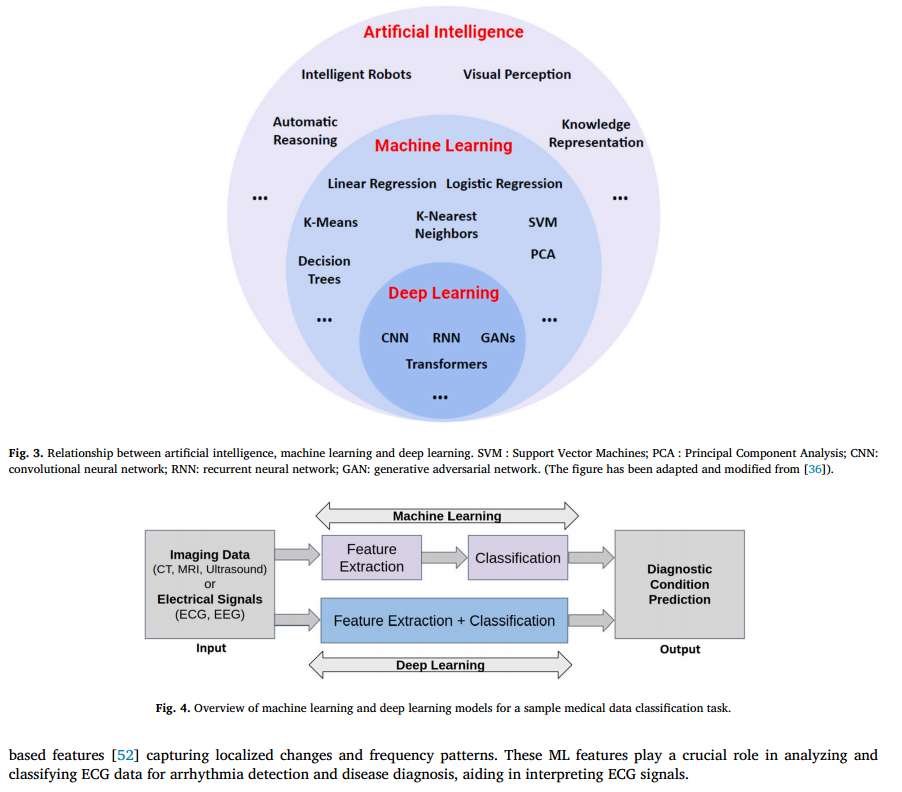

# 利用心电图对异常心律进行分类的高效人工智能模型综述

## 摘要

深度学习在利用心电图（ECG）波形进行数据分类方面取得了许多进展。在过去十年中，数据科学研究的重点是开发基于人工智能（AI）的模型，这些模型可以分析心电图波形，准确识别异常心律并对其进行分类。然而，==当前人工智能模型的主要缺点是，这些模型大多计算量大、计算密集、实时实施成本低==。在本综述中，我们首先讨论了目前用于基于心电图的心律分类的最先进人工智能模型。接下来，我们将介绍一些即将推出的建模方法，这些方法有望实时实现基于人工智能的心律诊断。这些模型具有轻便、计算效率高而又不影响准确性的特点，因此大有可为。当代模型主要利用 12 导联心电图来进行心律分类和心血管状态预测，这增加了计算负担，使实时实施具有挑战性。我们还总结了评估高效数据设置潜力的研究，这些数据设置可在不影响分类准确性的情况下减少心电图导联的数量。最后，我们展望了人工智能在精准医疗领域的应用前景，为准确预测和诊断患者的心血管状况提供了机会。

## 概述

心脏性猝死（SCD）通常表现为心律失常的首发症状，仅在欧洲，估计每年就有 35 万人因此而死亡[1]。心脏组织区域电生理特性（折返期、电压和传导速度）的异质性可导致传导不规则，从而引发心律失常 [2,3]。据称，约有 1.5%-5% 的普通人群表现为房性或室性心律失常 [4]，这些心律失常与大量发病、中风风险增加、住院和死亡有关，因此造成了巨大的经济和医疗负担 [5]。

通过测量心脏电活动随时间产生的电压变化，可以用数学方法解释心电图（ECG）的工作原理。心脏产生的电脉冲会调节心脏的收缩和舒张，从而导致皮肤上的电压发生微小变化。在 12 导联心电图等导联系统中，电极被精确定位在记录这些变化的区域。由此产生的 P、QRS 和 T 波形分别代表心房和心室的去极化和复极化，并与心动周期的不同阶段相对应。根据这些波之间的时间间隔可以推断心脏的传导系统，R-R 间期可用来计算心率[6]。心电图需要经过多个过程进行预处理，以提高信号质量并实现可靠的解读。具体来说，预处理步骤包括滤波以去除基线漂移和电源线干扰、通过高通滤波和去除伪影降低噪音、振幅归一化以保持一致性、R 峰检测以识别心室去极化、分割以分离单个心搏、质量控制以处理伪影、重新采样以获得统一的采样率、插值以处理缺失数据，以及心率归一化以进行比较分析[7]。这些预处理阶段确保了心电图数据的清洁和标准化，并为医疗专家的正确解读做好了准备，从而有助于诊断和治疗心血管疾病。

已知导致 SCD 的最常见室性心律失常表型是室性心动过速（VT）和室颤（VF）。植入式心律转复除颤器（ICD）是治疗致死性 VT/VF 的最主要、最有效的方法 [8]。据报道，每年有超过 20 万例 ICD 植入手术[9]，但由于人体心脏结构复杂，有效控制心率和预防致命性心律一直是一项挑战。同样，房性快速性心律失常虽然比 VT/VF 对生命的威胁小，但也对健康构成重大威胁，美国有 230 多万人患有房颤 [10]。房颤是导致中风的最主要原因之一，而目前的抗心律失常药物治疗或导管消融治疗策略仅部分有效。早期发现房颤对预防房颤相关并发症[11]和进行适当的针对性治疗[12]至关重要。

人工智能（AI）和先进计算技术的出现给医疗诊断带来了巨大变革[13]。在过去十年中，人们研究了新型机器学习（ML）和深度学习（DL）模式，利用心电图数据和其他生命体征指标预测患者的心血管状况，并协助医生进行诊断[14-26]。特别是，基于心电图数据的心律识别和分类一直备受重视，以帮助预测即将发生的心律失常并及时应用治疗。基于人工智能的方法包括神经网络、贝叶斯网络、模糊逻辑系统，以及使用线性或逻辑回归、决策树、最近邻、随机森林或支持向量机的机器学习模型，这些方法已被证明能准确预测患者的心血管预后[27,28,14,16]。此外，基于 12 导联心电图的分类算法在心律失常的早期诊断中表现出极高的精确度，凸显了基于人工智能的方法在支持心血管患者管理方面的潜力[29-31]。表 1 列出了使用人工智能模型识别的常见异常心律的详细信息。图 1 显示了心房去极化、心室去极化和复极化的心电图信号样本。此外，图 2 显示了一个典型的工作流程，详细说明了人工智能在心电图分析中的作用。如图所示

参考文献[32-35]对基于心电图的心律失常/心律分类进行了全面回顾。[32-35]对基于心电图的心律失常/心律分类进行了全面综述。除了对用于心电图分类的人工智能模型进行全面讨论外，我们还在本综述中对用于基于心电图的 “心律 ”分类的 “高效人工智能 ”模型进行了系统评估/分类。用于心电图分类的 “高效人工智能 ”模型分为三类进行介绍/讨论：（1）最小心电图导联输入模型（成本高效）；（2）轻量级深度学习模型（计算高效）；（3）数据注释高效模型（成本和时间高效）。手稿的其余部分安排如下： 第 2 节详细介绍了用于确定心电图分类任务最新进展的各种数据库。第 3 节讨论人工智能、机器学习和深度学习之间的关系。第 4 节详细分析了用于心电图分类的人工智能模型。第 5 节讨论了用于心电图分类的高效人工智能方法。最后，第 6 节对人工智能在精准医疗和远程保健中的作用进行了展望。

## 搜索策略

对谷歌学术（Google Scholar）和 PubMed 这两个主要数据库进行了全面搜索，没有语言限制。文献搜索的重点是使用 12 导联信号和优化的轻量级模型进行心电图分类的新型 ML 和 DL 技术，这些技术主要是在过去五年内开发的。重点是作为 Physionet 2020 和 2021 挑战赛的一部分而开发的方法。以下关键词被用作搜索标准： “深度学习或人工智能或机器学习或心律失常预测或轻量级模型或 Physionet 挑战）和心电图分类"）。在进行全面综述之前，我们将在下一节介绍人工智能、ML 和 DL 的一般概述。

## 人工智能

约翰-麦卡锡（John McCarthy）将人工智能描述为制造智能机器的科学和工程[37]。近年来，人工智能的本质是利用计算机建立模型，在没有人类参与或人类参与极少的情况下，对现实生活中的问题做出认知决策。在过去的二十年里，它影响了多个应用领域，从视觉感知到制造智能机器人，再到知识表示、自动编程和自动推理[38]。基于人工智能的分析在医疗诊断领域越来越受欢迎，因为它可以分析大量复杂的病人数据，并利用数据集中的关系来治疗和预测疾病[39]。机器学习是人工智能的一个子集，它不断发展并利用计算算法，通过对周围环境进行自适应学习来模拟人类智能[40]。机器学习的核心在于确定数据中的模式，这些模式最终可用于分析未知情况。DL 是人工智能和 ML 的进一步子集，与 ML 遵循相同的目标，但主要由多层神经网络组成。多个隐藏层的存在（因此被称为深度学习）使其在更广泛的数据和应用中更加高效和有效。最近，它已被广泛应用于医疗保健领域，如医疗成像以及医疗保健数据分析，用于各种任务，包括分类、诊断和治疗。

在过去五年中，DL 算法取得了巨大进步，许多研究小组都在积极研究可增强医疗诊断能力的新型 DL 模型[48-50]。图 3 展示了人工智能、ML 和 DL 之间的关系。图 4 显示了 ML 和 DL 之间的根本区别。ML 涉及从数据中手动选择重要信息（特征提取）并利用它们进行预测。另一方面，DL 使用人工神经网络（或其变体）从原始数据中自动学习重要模式。DL 需要大量数据才能很好地学习，并且需要功能强大的计算机。ML 的可解释性更强，因为人类会选择/手工制作重要信息，而 DL 通常更准确，但更难理解。如图 4 所示，对于医疗数据的样本分类任务（预测诊断条件：良性还是恶性），ML 算法需要手动制作特征来执行分类，而 DL 模型则自动完成特征提取和分类任务。在下面的小节中，我们将详细讨论与本综述相关的 ML 和 DL 模型，这将有助于更好地理解这些方法对当前问题的实用性。

### 机器学习

人工特征表征对 ML 方法影响很大。例如，在心电图信号处理中，这些特征包括平均值、标准差和心率变异性测量等时域特征[51]，功率谱密度等频域成分，偏度和熵等统计测量[51]，以及捕捉局部变化和频率模式的基于小波的特征[52]。这些 ML 特征在分析和分类心电图数据以进行心律失常检测和疾病诊断方面发挥着至关重要的作用，有助于解读心电信号。

### 深度学习

深度学习（DL）"一词由 Hinton 等人提出[53]，主要建立在人工神经网络（ANN）的概念之上。作为一个分支，DL 属于人工智能和 ML 的一个大桶（图 3）。它涉及构建各种神经网络，使这些模型模拟人脑处理数据的方式。这些模型已应用于多个领域，如智能医疗、机器人、自然语言处理（NLP）、网络安全等。人工智能网络由多个层组成，这些层是训练时使用的数据的抽象表示。训练这些人工智能网络通常需要大量数据（因此有时被称为 “数据饥渴 ”模型）。不过，一旦训练完成，这些模型与其他 ML 算法相比，准确率高，推理时间短 [54]。在此，我们将概述一些常用的 DL 架构，如用于心电图处理的卷积神经网络（CNN）和循环神经网络（RNN）。

#### 卷积神经网络

卷积神经网络（CNN 或 ConvNets）是一种流行的 DL 架构，几乎在所有领域都有应用，包括医学图像分析、视觉识别、NLP 以及更多此类应用。常用的 CNN 由多个卷积层组成，然后是子采样（池化）层，而结束层则随当前任务的不同而变化；例如，对于分类任务，最后一层可能是全连接层，而对于分割和超分辨率等任务，最后一层则是卷积层。这些网络的主要优势在于等效表示、稀疏交互和参数共享[55]。各种卷积层所涉及的卷积操作参数极少，有助于快速训练和避免过度拟合。目前，文献中存在多种 CNN 变体，如 AlexNet [56]、VGG-Net [57]、ResNet [58]等，可根据其学习能力用于手头的各种任务 [55]。

#### 循环神经网络

循环神经网络（RNN）是另一种著名的 DL 架构，可用于时间序列数据处理 [59-61]。主要应用于语音处理 [62]、NLP [63] 和顺序医疗数据，如 EEG [64]、ECG [65] 等。与标准的 CNN 架构相比，RNN 架构具有 “记忆 ”功能，这使其能够利用网络已经看到的当前和之前的输入来预测当前输出。这种架构有助于解码数据序列中蕴含的重要信息。例如，心电图中的 RNN 可用于理解连续心跳之间的时间依赖关系 [66]。

撇开 RNN 的优势不谈，标准的 RNN 架构存在严重的梯度消失问题[67]，使得学习数据中的长序列变得相当具有挑战性。长短时记忆（LSTM）[68] 架构就是为了解决这一问题而设计的。LSTM 架构引入了一个称为 “存储单元 ”的特殊区块，它可以长时间存储数据而不会遗忘，从而提高了学习效率。有三个门控制着信息流的进出，首先是 “输入门”，它决定哪些信息应该进入单元；其次是 “输出门”，它决定并控制当前单元的输出；最后是 “遗忘门”，它负责决定哪些上一状态单元的信息应该被记忆，哪些数据应该被删除和遗忘。LSTM 被认为是最成功的 RNN 架构之一，已在许多现实世界的领域中得到应用。

其他流行的 RNN 架构包括双向 LSTM/RNN 和门控递归单元 (GRU)[69]，它们与普通 LSTM 相似，但有细微差别。例如，BiLSTM 由两个标准 LSTM 模块组成：一个模块向前接收输入，另一个模块向后接收输入，这样它们就能同时访问未来和过去的数据。GRU 与 LSTM 类似，但只有两个门：“复位门 ”和 “更新门”。与 LSTM 相比，GRU 的计算速度相当快，而且可以捕捉重要的序列依赖关系，而不会丢弃信息[70]。

## 用于心电图心律分类的人工智能模型

### 基于 CNN 的模型

许多使用基于 DL 方法的模型已被提出，用于使用传统 12 导联信号对心电图进行分类[71]。在 PhysioNet 2020 挑战赛中，有人提出了各种新型算法，利用由 66,361 个 12 导联心电图记录组成的庞大数据库进行分类。本节将概述其中一些新型分类技术。在 41 个参赛团队中，使用基于变压器的神经网络的算法得分最高[72]，该算法使用广义加权准确度指标进行评估。他们的模型结合了由 ML 随机森林模型提取的心电图特征和从变压器神经网络自动学习的判别特征表征，从而提高了分类准确率。另一个研究小组提出了一种改进的 ResNet 模型，该模型使用较大的核大小来训练长期依赖关系，并在改进的 ResNet 中嵌入了挤压和激励层 (SE)[73]，该模型在 12 导联心电图分类中被证明非常有效。一种类似的基于 SE-ResNet 的方法结合了基于规则的模型和 “符号损失 ”来解决类不平衡问题，从而提高了模型的泛化能力和分类性能[74]。在另一种新颖的实现方法[75]中，注意力机制与双通道深度神经网络相结合，使网络能够捕捉到更丰富的心律失常信息，从而实现高效的心电图分类。还提出了其他几种方法，使用不同的模型来提高 12 导联分类算法的性能 [76]。

Garcia 等人[77] 整合了一个深度分支，该分支由带有扩张卷积层和挤压与激励块的改进 ResNet 组成，并与一个宽分支相连，该宽分支将 20 个心律特征整合到一个全连接的 3 层网络中。同样，一个基于 ResNet 架构和多头注意机制的模型表明，多头注意层可能不会对最终分类性能产生显著影响[78]。使用非对称损失函数对五个基于深度残差卷积神经网络的模型进行了优化，以对多导联心电图进行分类。最近，一项研究[79]使用 SE 深度残差网络捕捉了导联关系。作者提出了一种交叉标签策略，并应用符号增强损失函数来处理数据中的损坏标签。此外，他们还采用了一种 “pos-if-any-pos ”集合策略来处理应用中数据分布的不确定性。为了更详细地描述与标签映射相关的问题，他们开发了一个新模型 ResNet50 [80]，为训练更强大的分类模型提供了一个更好的起点。Kang 等人[81]开发了一种 “引导-明智 ”机制，以促进模型中的参数重用。这种机制在保持可比性能的同时缩小了模型规模。同样，最近提出的另一个[82]深度残差截取网络也采用了一种通道关注机制，以促进高效的计算。

从 12 导联心电图数据中提取不同的电生理特征来识别心律失常，分类准确率各不相同。Jimenez 等人[83] 根据心率变异性、QRST 模式和频谱域提取了每个心电图导联的 81 个特征，并针对每种心脏状况使用独立的二进制分类器进行单稳态分类。然后在两个二元监督分类器和一个无监督-监督混合分类系统中为每个类别选择了一个分类模型。Wickramasinghe 等人[84] 通过归一化、重采样和零填充对短于 20 秒的记录进行了预处理。记录的频域是通过快速傅立叶变换获得的。然后将信号的时域和频域输入两个独立的深度卷积神经网络。然后将这些网络的输出连接起来，并通过一个全连接层。输出结果使用双线索模型的夏普利加法解释进行解释，从而深入了解标记不一致的情况以及模型性能不佳的原因。最近开发了一种基于投票的线索无关混合分类器，它将通过 CNN 提取的特征与手工创建的特征相结合[85]。该方法改进了一些单独的分类，但并没有提供比基线 DL 方法更好的泛化效果。Zhao 等人[86]提出了一种 SE-ResNet 来自动学习深度特征，并在最后的全连接层中加入年龄和性别特征。他们还使用两位临床专家独立解释一组随机的 100 份有关左轴偏离的错误分类心电图，结果发现训练标签存在相当大的不一致性，这很可能会阻碍更精确模型的开发。另一项研究表明[74]，两个 SE-ResNet 模型和一个基于规则的模型的集合结合 Sign Loss 来解决类不平衡问题，提高了模型的泛化能力。

### 基于RNN的模型

最近开发了一种基于 LSTM 的集合分类模型，该模型由两个不同的特征集组成，其中第一个特征集通过傅立叶-贝塞尔扩展提取 RR 间期变异性，第二个特征集由基于时域和频域的手工创建特征组成[87]。另一种分类器由四个模块组成：散射变换（ST）、相位谐波相关（PHC）、深度可分离卷积（DSC）和 LSTM 网络，用于心律分类[88]。ST 可捕捉心电图的短期时间调制，而 PHC 则表征相干心电图成分的相位依赖性。输出结果被提供给 DSC，DSC 将每个 ST 或 PHC 系数的导联反应分别合并，然后将所有系数的结果值合并。两个 LSTM 层整合输入在长时间范围内的局部变化。最后，通过典型相关分析，可以将 12 导联 ST 和 PHC 表征迁移到缩减导联表征中进行学习。在一项比较研究中，Puszkarski 及其同事[89] 针对不同导联数（2、3、4、6、12）分析了四种架构（N-BEATS、LSTM、带窥孔的 LSTM、GRU），结果表明 LSTM、GRU 和 N-BEATS 效能最好，与带窥孔的 LSTM 效能相当。

## 心电图心律分类的高效模型

