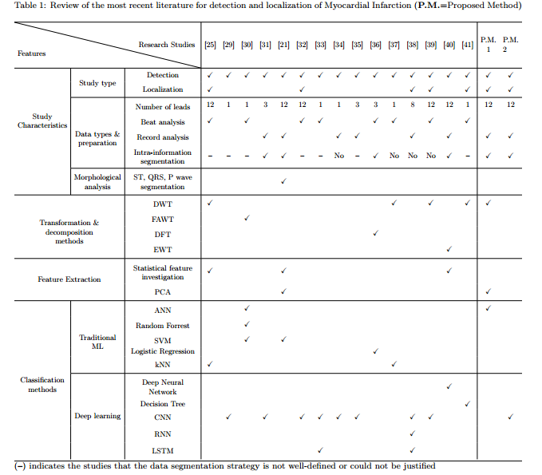

# Automating Detection and Localization of Myocardial Infarction using Shallow and End-to-End Deep Neural Networks

## 摘要

心肌梗死（MI），即心脏病发作，是一种常见的心脏疾病，由持续的心肌缺血引起。对于MI患者，==确定心肌缺血或停止供血的确切位置==至关重要。==自动定位系统==可以帮助医生在紧急情况下做出更好的决策。本文提出了两种基于12导联心电图的==MI检测和定位方法==，采用了通用和端到端的深度机器学习技术。在==特征提取阶段==，通用方法对预处理信号进行==离散小波变换（DWT）和主成分分析（PCA）==，然后通过==浅层神经网络（NN）进行分类==。而在端到端的残差深度学习技术中，直接对预处理输入信号使用==卷积神经网络（CNN）==。为了指定心肌梗死区域，考虑了6个亚诊断类别。所提模型通过物理技术联邦（PTB）数据集进行验证，其中每位患者的数据首先被分组，然后仔细划分为训练、测试和验证数据集。5折交叉验证的结果表明，通用模型在MI检测和定位中以更少的特征集实现了超过98%的准确率。此外，端到端CNN模型表现更为优越，取得了完美的结果。因此，较大的CNN模型可能需要更大的内存，而另一种模型则需要较小的内存，并接受约2%的假阳性和假阴性。

**关键词：**心肌梗死，心电图信号处理，深度残差学习，人工神经网络，离散小波变换，主成分分析

## 引言

根据2016年世界卫生组织（WHO）的报告，冠心病（也称为缺血性心脏病）是全球死亡的主要原因。WHO的研究显示，每年有超过1775万人死于心血管疾病，其中80%是由心脏病发作引起的。心脏病发作，即心肌梗死（MI），是由于冠状动脉部分或完全阻塞，导致心脏供血不足。根据急救指南，MI的检测和定位必须在可疑患者身上迅速进行。立即评估和确定MI的治疗优先级不仅可以降低患者的死亡风险，还能促使再灌注，防止组织坏死。

MI的诊断方法包括心电图（ECG）、超声心动图、磁共振成像（MRI）以及心脏生物标志物的变化，如肌酸激酶MB（CK-MB）、肌钙蛋白和肌红蛋白。在实践中，心电图是急需患者的首选诊断方法。心电图机在救护车和急诊室内常备，可提供快速且高度准确的心脏故障诊断，前提是正确解读。

许多研究已针对通过分析心电图信号自动检测MI，采用不同的机器学习和人工智能方法。文献中提出了多种==ECG信号预处理、特征提取和信号分类的方法==。然而，现有方法在准确性和计算复杂性方面仍面临挑战。Sun等人采用潜在主题多实例学习（LTMIL）分类器检测心肌梗死，使用==多项式系数拟合12导联ECG段中的一个通道==。Chang等人通过==隐马尔可夫、混合高斯和支持向量机（SVM）分类器==对12导联ECG数据进行了MI检测。Waduud等人对12导联ECG的ST幅度进行了实验，并确定了罪魁祸首动脉为左前降支和右冠状动脉。Dohare等人利用==SVM==检测MI，通过分析12导联ECG信号中平均心跳的200多个参数。

虽然检测MI至关重要，但==新研究的重点在于从心电图信号中提取更多信息==。例如，Adam等人使用==k-最近邻（kNN）==将心电图信号分类为MI、扩张型心肌病、肥厚型心肌病和正常四类。Le等人使用==向量心电图（VCG）和随机游走网络==结合三维正交平面，确定复杂的时空模式以检测和定位MI。Arif等人实现了==kNN分类器，并提取了心电图波形的时间域特征==，包括T波幅度、Q波和ST水平偏差。为了全面检测和定位罪魁祸首动脉，构建并评估了一个二分类和一个多分类的十个区域分类器。Acharya等人通过==将12导联ECG信号转化为4级离散小波变换==，研究了MI的解剖位置。从每个导联中==提取了包括熵和最大Lyapunov指数在内的12个非线性特征==，并采用==t检验特征排名方法选择最佳特征==。最终，使用==kNN分类器==在不同场景下评估了模型性能。Sharma等人构建了包括==kNN、线性和基于核的SVM在内的不同分类器==，首先检测梗死患者，然后将MI病变定位到六个不同区域。

近年来，随着深度学习方法的兴起，MI检测的研究大多转向实施这些方法。深度学习模型的一个优点是能够在无需大量信号处理的情况下实现高准确性。因此，信号可以高效分类，通常所需的信号数量较少。例如，Nezamabadi等人利用==多尺度深度卷积神经网络==从胸部HRCT信号中提取特征。为优化分类性能，Wu等人开发了一种==新的深度特征学习方法==，==优化后的特征输入到softmax回归中以构建多分类器==。表1展示了按==研究特征、信号转换、特征提取和分类方法分类==的最新MI检测和定位研究综述。

许多研究采用传统机器学习和深度学习技术来检测和定位心脏疾病（如心肌梗死），但这些研究存在一些主要缺陷，本研究旨在解决这些问题。首先，许多研究忽视了数据分割在分类方法中的重要性。如果测试数据集中部分数据在训练集中已经出现，模型性能可能被高估。因此，即使分类器的准确率很高，也可能无法可靠地对未来未见的数据进行分类。通过对现有文献的调查，只有少数研究在将数据划分为测试和验证集之前报告了对每位患者记录的分组策略。大多数研究没有正确隔离数据，或没有明确讨论分割过程。

针对这些缺陷，本研究的主要贡献如下：

1. 首先，研究强调了信号分割在训练和测试数据集中的重要性。本研究将每位患者的信号分组，以确保它们只分配到一个分区（即训练、验证或测试），从而使分类器在训练阶段不会部分检查患者数据，提高模型的鲁棒性。
2. 其次，为了建立一个同时检测和定位心肌梗死的综合框架，采用两种分类方法，并使用Physikalisch-Technische Bundesanstalt（PTB）数据库进行验证。第一种方法利用经典的心电图处理方法和新颖配置，包括一个浅层神经网络，用于检测和定位6个特定的梗死区域。第二种方法则采用端到端的卷积神经网络。结合传统神经网络和深度神经网络，使得可以在一个框架内比较两种模型的复杂性、效率和准确性。
3. 在传统神经网络模型中，采用了多种创新技术。尽管已知特征向量大小与分类器获得的准确率之间存在权衡，本研究构建了一个从心电图信号中提取较少特征的高准确率模型。为此，采用了主成分分析（PCA）和离散小波变换（DWT）的不同组合，提取心电图信号的独特特征。使用PCA，将MI检测中的信号数量从12个减少到7个，而在MI定位阶段减少到8个。结果表明，分类器在检测和定位MI时的准确率分别超过99%和98%。
4. 最后，通过利用端到端深度神经网络，我们能够构建高效的模型，只需少量步骤就能从原始信号中检测和定位MI。这一优势使得这些分类方法可以在大数据集上应用，并简化所需的硬件设计。我们提出的端到端MI检测和定位分类器在MI患者中取得了完美的结果。

本文其余部分组织如下：第二部分专注于我们的方法，全面解释了检测和定位MI的框架；第三部分概述了本研究使用的数据集；第四部分展示了所提模型的结果，随后在第五部分进行评估和性能讨论；最后，第六部分总结了本文并提出未来研究方向。

## 方法

为了检测和定位心肌梗死（MI），实现并比较了两种自动方法（即经典的多导联心电图处理系统和端到端深度神经网络）。每种方法的第一步是信号预处理，如图1所示。接下来的步骤根据技术类型的不同而有所区别。在经典方法中，需要执行多个变换和特征提取层；而在端到端深度学习方法中，预处理后的信号直接输入深度网络，而无需额外处理。以下部分将进一步探讨这些方法的细节。

### 2.1 预处理阶段

心电图（ECG）信号可能受到两种主要伪影的干扰：首先是高频噪声，如由肌电图（EMG）引起的噪声、电极上的机械力以及电源线干扰；其次是基线漂移（BW），这可能是由于患者移动、呼吸或在心电图记录过程中设备不稳定造成的。分析心电图信号之前，需要去除信号中的噪声，同时保留信号的主要信息。在本研究中，如图2所示，通过应用60赫兹的陷波滤波器（带宽为3 dB的5 Hz），抑制残余的电源线干扰及其谐波，这种滤波器也称为带阻滤波器。此外，采用三阶三次样条插值（CSI）去除基线漂移，该方法能够恢复去趋势信号中的等电位水平。在该技术中，立方多项式被拟合到原始心电图信号的一组代表性点上。因此，可以考虑参考点来获得信号的低频趋势。拟合的基线随后从心电图信号中减去，以去除该伪影。

### 2.2 经典方法

在预处理阶段之后，进行一系列离散小波变换（DWT）和主成分分析（PCA）变换，以提取信号的独特特征。利用提取的特征，浅层神经网络被训练用于检测和定位心肌梗死，具体细节将在以下小节中简要讨论。

#### 2.2.1 特征提取

在对心电图（ECG）信号去噪后，信号被分解为小波系数。小波变换（WT）是信号与特定小波函数的数学卷积，用来表示信号的时频特性。信号 $ f(t) $ 的小波变换 $ W_f(a, \tau) $ 是通过小波基函数 $ \Psi(t) $ 在尺度 $ a $ 和位置或时间 $ \tau $ 进行的，公式如下所示：

$$
W_{f(a, \tau)} = \frac{1}{\sqrt{a}} \int_{-\infty}^{\infty} f(t) \psi\left(\frac{t - \tau}{a}\right) dt
$$
为了在数字信号上实现小波，使用预定义离散尺度的离散小波变换（DWT）。要分解信号，采用了双二进制小波变换，该变换表征了基本小波的形状并覆盖了感兴趣的区域。基于母小波的平方伸缩，双二进制小波在尺度 $ 2^j $（或第 $ j $ 级）上的定义如下式：

$$
\Psi_{2^j}(t) = \frac{1}{\sqrt{2^j}} \psi\left(\frac{t}{2^j}\right)
$$
使用双二进制小波在第 $ L $ 级对心电图信号进行多分辨率分解时，可通过 $ L + 1 $ 个子带系数表示，其中一个是近似系数（$ A_L $），其余 $ L $ 个是详细子带系数，分别命名为 $ D_L, D_{L-1}, \dots, D_1 $【47】。在本文中，针对每个心电图导联信号，执行了6级小波分解，采用的是Daubechies 4阶小波函数。通过使用 $ L = 6 $，可以构建近似子带矩阵 $ A_6 = \{A_6^1, A_6^2, \dots, A_6^m\} $ 和六个详细子带矩阵 $ D_i = \{D_i^1, D_i^2, \dots, D_i^m\} $，其中 $ m = 12 $ 是心电图导联数，$ i = 1, 2, \dots, 6 $ 是系数级别【26】。

从所构建的矩阵 $ \{A_6, D_i; i = 1, 2, \dots, 6\} $ 中可以提取出一组显著特征。正如研究【26】所示，不同的统计和频谱特征集在此过程中被采用（如标准差、信号功率和主导频率）。我们的分析表明，只有那些具有显著影响的特征集被保留，其他特征集被去除。根据统计显著性检验，最小p值小于0.01。在最终保留的特征集中，频率较高的特征子带（例如超过62.5 Hz的高频内容）被排除。作为结果，仅使用 $ A_6, D_6, D_5, D_4 $ 进行进一步特征提取。